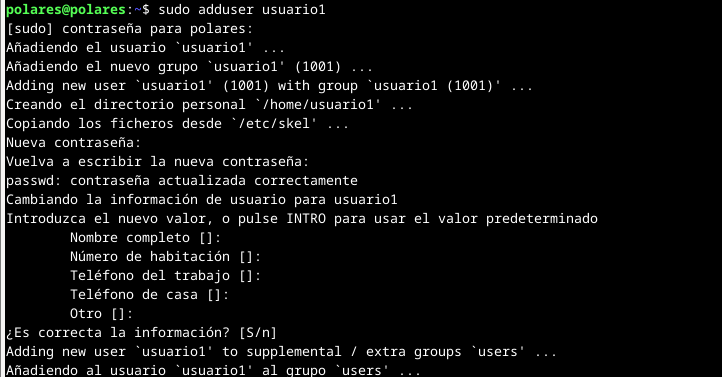
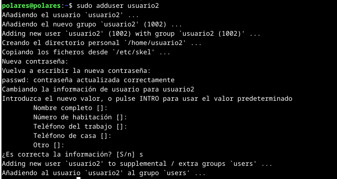
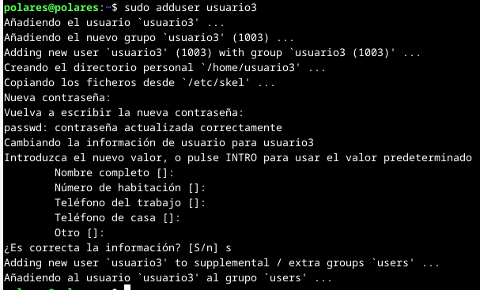
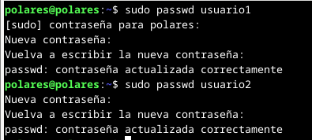
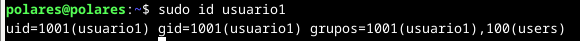
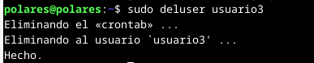
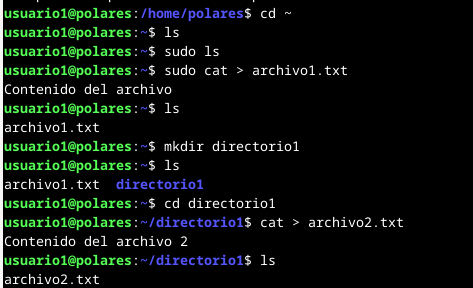
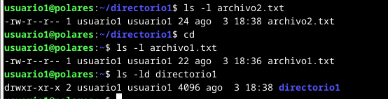
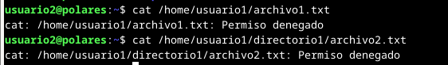

# Sistemas Operativos 1
## _Actividad 3_
##
##### Anthony Alexander Aquino Santiago - 202001923
##
##
##
## Parte 1 - Gestión de usuarios
### 1. Creación de usuarios
```
sudo adduser usuario1
sudo adduser usuario2
sudo adduser usuario3
```




### 2. Asignacion de contraseñas
```
sudo passwd usuario1
sudo passwd usuario2
```


### 3. Información de usuarios
```
sudo id usuario1
```


### 4. Eliminación de usuarios
```
sudo deluser usuario3
```


## Parte 2 - Gestión de grupos
### 1. Creación de grupos
```
sudo groupadd grupo1
sudo groupadd grupo2
```


### 2. Agregar usuarios a grupos
```
sudo usermod -aG grupo1 usuario1
sudo usermod -aG grupo2 usuario2
```


### 3. Verificar membresía
```
groups usuario1
groups usuario2
```


### 4. Eliminar grupo
```
sudo groupdel grupo2
```


## Parte 3 - Gestión de permisos
### 1. Creación de archivos y directorios
```
cd ~
cat > archivo1.txt
mkdir directorio1
cd directorio1
cat > archivo2.txt
```


### 2. Verificar permisos 
```
ls -l archivo2.txt
ls -l archivo1.txt
ls -ld directorio1
```


### 3. Modificar permisos usando chmod con modo numérico
```
chmod 640 archivo1.txt
```


### 4. Modificar permisos usando chmod con modo simbólico
```
chmod u+x archivo2.txt
```


### 5. Cambiar el grupo propietario
```
chgrp grupo1 archivo2.txt
```


### 6. Configurar permisos de directorio
```
chmod 740 directorio1
```


### 7. Comprobación de acceso
```
su usuario2
cd ~
cat /home/usuario1/archivo1.txt
cat /home/usuario1/directorio1/archivo2.txt
```


### 8. Verificación final
```
ls -l archivo2.txt
ls -l archivo1.txt
ls -ld directorio1
```
